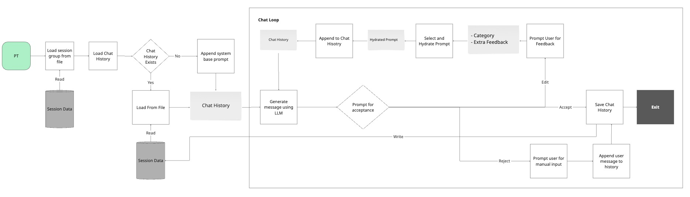

# Question 2a

## Physical Therapy Chat Application Analysis

This application is designed to help Physical Therapists (PTs) communicate with patients through a chat interface. The system enables therapists to review auto-generated follow-up messages, edit them with specific feedback categories, and maintain chat history across sessions.

### Component Breakdown

#### 1. `chat.py`

The main module containing all functionality:
- Chat session management
- Message generation via LLM (GPT-4o-mini)
- Feedback collection and message refinement
- Message acceptance/rejection flow

Code components:
- `FeedbackOption` enum: Categories for feedback (`tone`, `generic`, `engagement`, `factuality`, `other`)
- `prompt_for_acceptance()`: CLI interface for message review
- `prompt_for_feedback()`: CLI interface for feedback collection
- `llm()`: Interface to the chat model
- `run_chat()`: Main chat loop that orchestrates the entire flow

### 2. `io.py`

Handles file I/O operations:
- `load_prompts()`: Loads system prompts from YAML (`prompts/prompts.yml`)
- `load_chat_history()`: Loads chat history from JSONL file. File are identified by UUID
- `save_chat_history()`: Persists conversation to JSONL file. File are identified by UUID

### 3. `main.py`

Entry point with CLI commands (provided):
- `get_message()`: Initiates chat session with specified group

### 4. Makefile

The `Makefile` target was modified to accept a session group identifier:

```makefile
.PHONY: get-message
get-message:
	message get-message $(session_group)

```

**Usage:** `make get-message session_group=<session_group>`

---

## Workflow Breakdown

The application can be thought as a state machine, with distinct states: (generate → review → accept/edit/reject)

1. **Initialization Process**:
   - User invokes `make get-message session_group=<session_group>` (calls `main.py`)
   - Main calls `run_chat()` in `chat.py`
   - `run_chat()` loads session features, prompts, and chat history
   - System initializes chat with base prompt (if chat history is empty) + session data

2. **Message Generation Process**:
   - Chat history sent to `llm()` function
   - LLM generates message based on history
   - Message displayed to therapist for review

3. **Feedback Loop**:
   - If message edited, feedback added to history
   - New message generated incorporating feedback
   - Process repeats until message accepted or rejected

4. **Persistence Mechanism**:
   - At end of session, `save_chat_history()` writes to disk
   - Each new session loads previous history for context



### Prompts Relationships

There are 2 prompt archetypes:
- `SYSTEM_BASE`: The base prompt that is used to generate the message
- `SYSTEM_FEEDBACK`: The feedback prompt that is used to generate the feedback

The `SYSTEM_BASE` prompt is used to generate the initial message, and the `SYSTEM_FEEDBACK` prompt is used to generate the feedback.

The `SYSTEM_FEEDBACK` prompt is used to generate the feedback. It depends on the various feedback categories.


---

## Code Analysis

### `chat.py`

This is the core module handling the chat functionality:

**Imports and Setup**:
   - Uses `StrEnum` to define feedback categories
   - Imports I/O functions (`load_chat_history`, `load_prompts`, `save_chat_history`)
   - Creates a unique UUID for each chat session
   - Loads system configuration with `get_settings()`
   - Instantiates the chat model with `ChatModel()`

**Feedback System**:
   - `FeedbackOption` enum defines 5 categories: `tone`, `generic`, `engagement`, `factuality`, `other`
   - `FEEDBACK_PROMPT_MAP` dictionary maps each category to specific prompt templates
   - These prompts guide the LLM in improving messages based on therapist feedback

**User Interaction Functions**:
   - `prompt_for_acceptance()`: Simple CLI input loop that forces user to choose `accept`, `edit`, or `reject`
    - Validation: user must choose one of the options, otherwise the loop will continue
   - `prompt_for_feedback()`: Two-step input collection for feedback category and specific comments
    - If no category is provided, the default is `other`
    - If an invalid category is provided, the loop will continue
    - Text feedback is only requested if a category is provided (can be empty, defaults to `other`)
    - If no comments are provided, the loop will continue
   - Both functions include input validation to ensure proper data capture

**LLM Interface**:
   - `llm()` function wraps the model interface
   - Sets temperature to `0` (for more _deterministic_ outputs)
   - Uses `gpt-4o-mini` model
   - Passes the entire message history to maintain context

**Main Chat Loop** (`run_chat`):
   - Loads session data with `get_features(session_group=session_group)`
   - Loads chat history with `load_chat_history(chat_id=chat_id)`
    - Creates new chat file if it does not exist
   - Initializes chat history with system prompt if empty
   - Enters main loop where:
     - Message is generated with LLM
     - Therapist reviews and decides action
        - For `accept`: adds message to history
        - For `edit`: collects feedback, adds system instruction + feedback to history, and restarts loop (i.e. generates new message and goes back to therapist review)
        - For `reject`: therapist writes their own message and adds it to history
   - Saves chat history at end of session
   - Includes exception handling to ensure history is saved even on error (graceful shutdown)

### Potential Improvements

There are numerous potential improvements that could be made to the application, some include:
- Error handling captures all exceptions the same way
- The temporary/edited messages remain in chat history permanently. Alternatively, only the final message could be saved.
- Chat history is saved synchronously, which could be optimized by using a background task.
- All chat history is used in the LLM prompt, which could be optimized by using a smaller subset of the history.
- Chat history could be incrementally saved.

### `io.py`

This module handles all file operations:

**Prompt Loading**:
- `load_prompts()` reads YAML file from `prompts/prompts.yml`
- Returns dictionary of prompt templates for system and feedback messages

**Chat History Management**:
- `load_chat_history()`: Creates `.chats` directory if needed, reads JSONL file for chat ID
- Returns empty list for new chats, or list of message dictionaries for existing chats
- Messages stored as JSON objects, one per line
   
**History Saving**:
- `save_chat_history()`: Writes messages to JSONL file
- Function is async but doesn't use async file operations internally
- Overwrites entire file on each save (potential optimization point)

**File Structure**:
- Chat histories stored at `.chats/{chat_id}.jsonl`
- Prompts stored at `prompts/prompts.yml`

### `main.py`

The entry point for the application:

**Command Structure**:
- Uses Typer for CLI interface
- `get_message()` function wraps the chat functionality
- Takes "session_group" parameter to identify which patient/session data to load
- Uses asyncio to run the async chat function

**Execution Flow**:
- Calls `run_chat()` function from `chat.py`

### Prompts

The system is configured with several prompt templates. Prompts are loaded from `prompts/prompts.yml`.

**Base System Prompt**: 
- Defines the assistant's role as a physical therapist assistant
- Explains importance of chat interactions in remote therapy
- Details goals of acknowledging session completion, reinforcing communication, and keeping patients engaged
- Provides guidelines and examples for different session outcomes

**Feedback System Prompt**:
- Template for improving messages
- Incorporates feedback category and specific comments

**Category-Specific Prompts**:
- `TONE_PROMPT`: Focus on conversational language
- `GENERIC_PROMPT`: Ensures proper message structure
- `ENGAGEMENT_PROMPT`: Emphasizes patient engagement
- `FACTUALITY_PROMPT`: Ensures accuracy based on session data
- `OTHER_PROMPT`: Catch-all for specific suggestions

---

## Enhancement Opportunities

### Asynchronous I/O Optimization

**Issues:**
- File operations block the main execution thread
- `save_chat_history()` is async but doesn't leverage asynchronous file I/O

**Recommendations:**
- Implement true asynchronous file operations with `aiofiles`
- Add background saving to prevent UI lag
```python
import aiofiles

async def save_chat_history(chat_id, chat_history):
    """Save chat history asynchronously without blocking."""
    chat_file = os.path.join(".chats", f"{chat_id}.jsonl")
    async with aiofiles.open(chat_file, "w") as f:
        for message in chat_history:
            await f.write(json.dumps(message) + "\n")
```

### Error Handling & Recovery

**Issues:**
- Basic exception handling exists but lacks granularity
- No recovery mechanism for interrupted sessions

**Solution:**
- Implement specific exception handlers for different error types
- Add session recovery mechanism
```python
async def run_chat(session_group):
    try:
        # Existing code...
    except FileNotFoundError:
        print("[ERROR] Session data not found. Creating new session.")
        # Recovery logic
    except NetworkError:
        print("[ERROR] Connection to LLM service failed.")
        # Retry logic
    except Exception as e:
        # General fallback
```

### Testing & Evaluation Framework

**Issues:**
- No testing infrastructure
- No metrics for message quality

**Solution:**
- Add unit tests for each component
- Implement evaluation metrics for message quality (LLM as a Judge, interaction examples, etc.)

### Other Improvements
- Enhanced Feedback Collection
- Model Choice Flexibility
- Load from previous chat session
- User Experience
- Extend application state graph and prompts for enhanced personalization

### Implementation Priorities

Given the current state of the application and the outlined recommendations, the following are the implementation priorities, which can have the highest impact with the least effort:
- Unit tests
- Enhanced error handling
- Asynchronous file I/O with `aiofiles`
- User experience improvements
