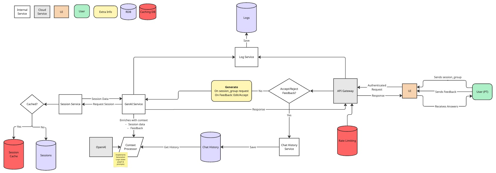

# Design Document: AI-Powered PT Messaging System

## Problem/Motivation

Physical Therapists (PTs) currently manually draft messages to patients following each therapy session, based on session results and predefined guidelines. This process is time-consuming and inconsistent in quality. Automating message generation will streamline PT workflows and ensure high-quality, empathetic, and engaging communication with patients.

### Motivation

- **Efficiency**: Reduce the time PTs spend on repetitive messaging tasks.
- **Consistency**: Standardize messaging quality across all PTs.
- **Engagement**: Maintain patient motivation and adherence to therapy.
- **Scalability**: Support a growing number of patients without increasing PT workload.

## Overview of the Solution

The proposed solution is an AI-powered system that generates personalized messages for PTs to review and send. It integrates with Sword's Digital Physical Therapy platform and uses OpenAI's GPT models to create messages based on session results.

### Key Features

- AI-generated messages tailored to session outcomes.
- Editable suggestions for PTs to customize before sending.
- Context-aware personalization using patient history.
- Compliance with tone, structure, and engagement guidelines.
- Secure, scalable deployment.

## Success Metrics

| Success Metric | Target | How to Measure |
|----------------|--------|----------------|
| **PT message drafting time** | >50% time saved per message | Compare timestamps between message generation and sending before and after implementation; track average time spent in message editor |
| **PT adoption rate** | >80% of messages accepted or minimally edited | Track percentage of AI-generated messages that are sent with no edits or minimal edits (<20% content change) |
| **Patient engagement** | >10% increase in session adherence | Compare session completion rates before and after implementation; measure percentage of scheduled sessions completed within recommended timeframe |
| **Message rejection rate** | <5% of messages rejected | Track percentage of AI-generated messages that PTs discard and write from scratch instead |
| **Patient satisfaction** | >95% positive feedback on communication quality | Survey patients on communication quality; analyze sentiment in patient responses to PT messages |
| **Cost efficiency** | <$0.10 average cost per message generated | Calculate total API costs and infrastructure expenses divided by number of messages generated |

### Objectives and Key Results (OKRs)

#### Objective 1: Optimize PT Workflow Efficiency
- **KR1**: Reduce message drafting time by >50% within 3 months of full deployment
- **KR2**: Decrease average time spent on patient communication by 80% per PT within 6 months
- **KR3**: Increase PT capacity (patients per PT) by 20% within 9 months

#### Objective 2: Enhance Message Quality and Consistency
- **KR1**: Achieve >80% message acceptance rate (without edits) by PTs within 3 months
- **KR2**: Maintain message quality score of 4/5 based on PT feedback
- **KR3**: Achieve message rejection rate by <5% compared to manual messaging

#### Objective 3: Improve Patient Engagement and Outcomes
- **KR1**: Increase patient session adherence by 15% within 6 months
- **KR2**: Achieve patient satisfaction scores of >95% related to PT communication
- **KR3**: Reduce patient program dropout rates by 10% within 9 months

#### Objective 4: Ensure System Reliability and Scalability
- **KR1**: Achieve 99.9% system uptime
- **KR2**: Maintain message generation latency under 3 seconds for 95% of requests
- **KR3**: Support 3x growth in message volume without performance degradation over 12 months

## Methodology

### AI Model Selection & Workflow

- **Primary Model**: GPT-4o-mini (fast and cheap) via OpenAI's API for message generation.
- **Fallback Model**: GPT-4o (more powerful, but much more expensive) for ensuring quality.
- **LLM Workflow**: Use LLM workflows (graphs) for enhanced context and quality (i.e. states and transitions).
- **Contextual Retrieval**: Sessions integration for efficient patient history access; relational database for patient history.
- **Fine-tuning Strategy** (Optional): Collect and annotate high-quality PT messages for fine-tuning; might not be required if prompts, context and model are powerful enough.

### Message Generation Pipeline

1. **Input Preparation**: Gather session results, previous interactions, and patient engagement data.
2. **Prompt Engineering**: Create structured prompts to guide the model's output.
3. **Model Inference**: Generate message suggestions using OpenAI's API.
4. **Post-Processing - Guardrails**: Validate message format, remove redundancy, and apply business rules (continuous improvements of LLMs can potentially remove this task combined with human in the loop).
5. **UI Integration**: Display the message with options to accept, edit, or reject.
6. **Feedback Loop**: Capture PT feedback for continuous model improvement.

### Data Requirements

- **Session Data**: Exercise results, completion metrics, and session classification.
- **Patient History**: Previous messages, session patterns, reported issues.
- **PT Preferences**: Communication style, common edits, rejection patterns.
- **Guideline Database**: Structured repository of messaging best practices.

### Data Compliance

- Ensure patient data privacy (compliance with GDPR, healthcare data regulation (e.g. HIPAA) and others).
- Maintain a human-in-the-loop approach for PT oversight.
- Avoid AI over-reliance by allowing PTs to override AI suggestions and inplace edits.
- Regular audit of message quality and compliance with guidelines (e.g. LLM as Judge, weekly flagged interactions).

## Implementation Plan

### Technical Architecture

This architecture can be further enhanced with the following recommendations:
- Implement robust authentication, authorization, rate limiting, and data encryption.
- Add retry mechanisms and fallback strategies.
- More granular microservices architecture, use message queues.
- Implement comprehensive logging, distributed tracing, monitoring, and alerting.
- Optimize OpenAI context processing with truncation and efficient prompts.

### Technical Stack

- **Backend**: Python (FastAPI) for API endpoints with async support.
- **Frontend**: React/Angular components integrated with existing PT portal.
- **Database**:
  - PostgreSQL for patient session history and structured data.
  - Redis for caching frequent requests and rate limiting.
  - Potential add-on: PGVector or Qdrant for vector embeddings and semantic search.
- **Cloud Provider**: AWS (Lambda, S3, RDS, etc) for scalable infrastructure.
- **CI/CD**: GitHub Actions for deployment automation with canary releases.
- **Monitoring**:
  - AWS CloudWatch for infrastructure metrics.
  - Datadog or New Relic for application performance monitoring.
  - Prometheus for custom metrics collection.
  - Grafana for visualization.
- **Logging**: AWS CloudWatch and/or ELK stack (Elasticsearch, Logstash, Kibana) for structured logging.
- **Security**: AWS KMS or Hashicorp Vault for encryption, AWS WAF for API protection.

#### Application Performance Metrics (APMs)

- **System Uptime**: 99.9% uptime SLA.
- **API Latency**: <3 seconds for 95th percentile.
- **Error Rate**: <1% of requests (migh be hard to achieve given strong reliance on OpenAI).
- **Resource Utilization**: Monitor CPU, memory, and disk usage.

### Data Privacy and Governance

- **Data Minimization**: Process only necessary patient data for message generation.
- **Encryption**: End-to-end encryption for data at rest (and potentially in transit).
- **Access Control**: Role-based access with principle of least privilege.
- **Audit Trail**: Comprehensive logging of all data access and modifications.
- **Retention Policy**: Clearly defined data retention and deletion schedules (e.g. right to be forgotten).
- **Data Processing Agreement**: Use OpenAI's Enterprise.

### Monitoring and Evaluation Strategy

- **Model Performance**:
  - Message acceptance rate
  - Edit distance metrics (e.g. Levenshtein distance)
  - LLM as a Judge
  - Cosine similarity between PT edits and original messages
- **System Performance**:
  - API latency and throughput
  - Error rates and types
  - Resource utilization
- **Business Impact**:
  - PT time savings
  - Patient engagement metrics
  - Cost per message

### Deployment Considerations

- Initial rollout to a small cohort of PTs for feedback (e.g. 10% of team).
- A/B testing of different prompt strategies with the pilot group.
- Gradual expansion based on performance metrics (e.g. engagement metrics, PT efficiency).
- Ongoing model monitoring and improvement cycle.
- Feature flag system to quickly disable AI generation if issues arise.

## Main Delivery Milestones and Timeline

| Working Block                      | Milestone                              | Man/Sprint | Dependencies                     |
| ---------------------------------- | -------------------------------------- | ----------- | -------------------------------- |
| **Phase 1: Research & Planning**   | Model selection & feasibility study    | 2 / Sprint 1 | None                             |
|                                    | Finalize prompt engineering strategy   | 2 / Sprint 2 | Model selection                  |
| **Phase 2: Prototype Development** | Backend API implementation             | 3 / Sprint 3 | Prompt engineering completed     |
|                                    | Model integration & message generation | 3 / Sprint 4 | Backend API ready                |
|                                    | UI integration for PT feedback         | 2 / Sprint 5 | Model integration completed      |
| **Phase 3: Testing & Refinement**  | Internal testing with PTs              | 3 / Sprint 6 | UI integration completed         |
|                                    | Iterate on model and feedback loop     | 3 / Sprint 7 | Internal testing results         |
| **Phase 4: Deployment & Scaling**  | Pilot deployment to select PTs         | 3 / Sprint 8 | Model iteration complete         |
|                                    | Performance monitoring & adjustments   | 2 / Sprint 9-10 | Pilot deployment                 |
|                                    | Full rollout                           | 3 / Sprint 10 | Performance monitoring results   |
| **Phase 5: Optimization & Expansion** | Cost optimization strategies        | 2 / Sprint 11 | Full rollout complete            |
|                                    | Implement feedback-based fine-tuning   | 3 / Sprint 12 | Sufficient feedback collected    |
|                                    | Analytics dashboard for PTs            | 2 / Sprint 13 | Fine-tuning implementation       |

## Cost Analysis

#### Assumptions:

> Not considering costs for development, maintenance, compliance and other subscriptions.

- SWORD has 25,000+ enterprise clients.
- **15000** daily active users.
- **3 AI-generated messages per user per day.**
- **gpt-4o-mini** for message generation.
- Prompts take **~1000 tokens** (input).
- Messages (output) average **250 tokens**, leaving a significant margin (the examples in description have ~150 tokens).
- Infrastructure costs based on AWS pricing benchmarks.

##### Resources:
- [tokenizer](https://platform.openai.com/tokenizer)
- [LLM Price Check](https://llmpricecheck.com/)

| Component                   | Estimated Monthly Cost | Notes                                      |
|----------------------------|----------------------|------------------------------------------|
| **OpenAI API Usage**       | $405 - $2,250       | Based on 1,350,000 messages/month (15000 * 3 * 30). Cost varies based on token usage. |
| **AWS Infrastructure**      | $2,500 - $5,000     | Covers Lambda (serverless functions), S3 (storage), CloudWatch (monitoring), and API Gateway. |
| **Total Monthly Cost**      | **$3,000 - $7,500** | Expected to decrease over time with optimizations. |

#### Costs per model:
- `gpt-4o-mini`: $405
- `gpt-4o`: $6750 (table above assumes upper bound as 1/3 of this)

#### Infrastructure costs:
There's a big level of uncertainty here, since networking costs are bery hard to measure.
- Lower bound: $2,500 the cost of a small kubernetes cluster.
- Upper bound: $5,000 the cost of a medium kubernetes cluster.

#### Total Monthly Cost:
Can assume $5000 as a middle ground.

- Total Annual Cost: $5000 * 12 = **$60,000**
- Accounting for a 15% slipage: **$69,000**

## Other Relevant Considerations

The new project can leverage some Sword Health blueprints for quicker integration.

It should also deploy a rule-based fallback system for low-confidence AI outputs.

### Risks & Mitigation

- **AI Output Quality**  
  - **Impact:** High  
  - **Probability:** Medium  
  - **Mitigation:** Continuous monitoring, human review, robust testing  
  - **Misc:** Recent advancements in AI have shown promise in message generation quality.

- **PT Adoption Resistance**  
  - **Impact:** High  
  - **Probability:** Low  
  - **Mitigation:** User-friendly UI, training sessions, PT champions  
  - **Misc:** PTs may be resistant to change and may not be willing to use the new system. But LLM usage has skyrocketed in recent years, and the quality of AI-generated messages has improved significantly.

- **Data Privacy Breach**  
  - **Impact:** High  
  - **Probability:** Low  
  - **Mitigation:** End-to-end encryption, access controls, audits
  - **Misc:** Data privacy concerns are less likely since the system will only process patient data for message generation using OpenAI's Enterprise, which has strict data privacy and security measures, and Sword Health's own data privacy policies.

- **Cost Overruns**  
  - **Impact:** Medium  
  - **Probability:** Medium  
  - **Mitigation:** Budget monitoring, cost-saving optimizations  
  - **Misc:** Cost overruns are less likely since the system is not expected to handle a large number of users.

- **Missing Timeline**  
  - **Impact:** Medium
  - **Probability:** Medium  
  - **Mitigation:** Detailed timeline, phased rollout
  - **Misc:** Missing timeline is not very likely since the system is not overly complex.

- **Scalability Concerns**  
  - **Impact:** Medium
  - **Probability:** Medium
  - **Mitigation:** Load testing, optimize API calls, caching
  - **Misc:** Scalability concerns are less likely since the system is not expected to handle a large number of users. But OpenAI has had issues with scalability and outages in the past.

### Future Enhancements

- **Automated feedback loop** to refine AI-generated messages.
- **Multilingual support** for global patient reach - even though SWORD Health is currently US based, there are many employees which English is not their primary language.
- **PT Voice Twin** to provide a human-like experience.
- **Message effectiveness analytics** to correlate with patient outcomes.
- **Expanded message types** beyond post-session feedback.
